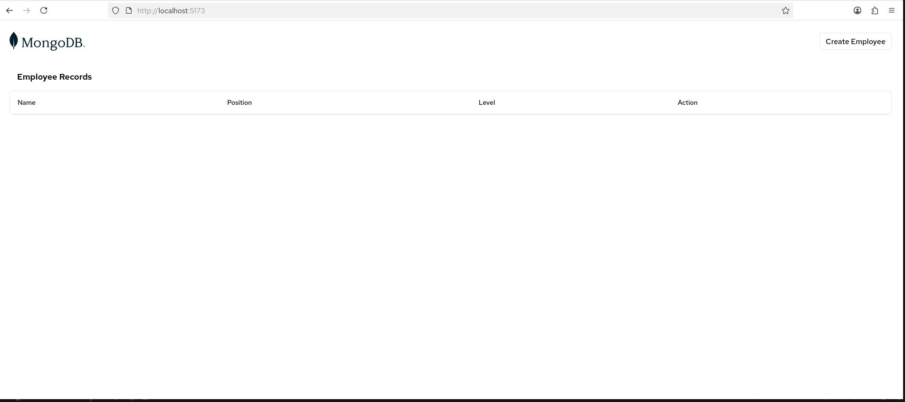
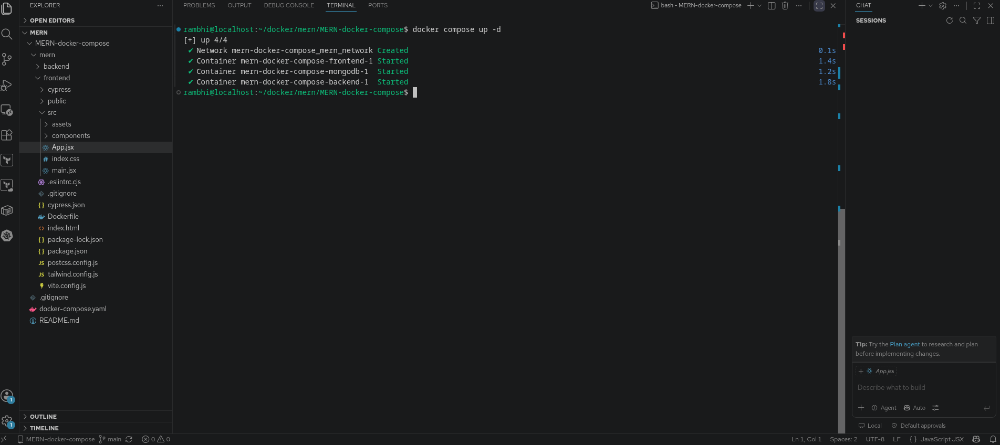

# 🚀 Dockerized MERN Stack Application


A production-style **MERN Stack** application containerized using **Docker** and **Docker Compose**.

This project demonstrates how to package a complete MERN Stack application into containers and run the entire application with a single command using Docker Compose.

---

# 📌 Project Overview

This project contains:

- ⚛️ React Frontend
- 🟢 Node.js + Express Backend
- 🍃 MongoDB Database
- 🐳 Docker
- 🐳 Docker Compose

Every service runs inside its own container.

---

# 🏗️ Architecture

```
                  User
                    │
                    ▼
         http://localhost:5173
                    │
                    ▼
          React Frontend Container
                    │
        API Calls (backend:5050)
                    │
                    ▼
       Node.js + Express Container
                    │
         MongoDB (27017)
                    │
                    ▼
            MongoDB Container
```

---

# 🖼️ Application Screenshot



---

# 🐳 Docker Compose



Docker Compose is used to manage all containers using a single YAML file.

Run the complete project using

```bash
docker compose up --build
```

---

# 📦 Running Containers


All application services are running in isolated Docker containers.

---

# 🖼️ Docker Images


Docker images are built separately for:

- Frontend
- Backend
- MongoDB

---

# 🌐 Docker Network


All containers communicate over a custom Docker bridge network.

---

# 💾 Docker Volumes


Docker volumes are used to persist MongoDB data even after containers are removed.

---

# 📂 Project Structure

```
mern-docker-project
│
├── docker-compose.yaml
├── README.md
├── docs
│   ├── page.png
│   ├── compose.png
│   ├── containers.png
│   ├── images.png
│   ├── networks.png
│   └── volumes.png
│
└── mern
    ├── frontend
    │   ├── Dockerfile
    │   └── src
    │
    └── backend
        ├── Dockerfile
        └── routes
```

---

# ⚙️ Tech Stack

- React
- Node.js
- Express.js
- MongoDB
- Docker
- Docker Compose
- Git
- GitHub
- Linux

---

# ✨ Features

- Dockerized React Frontend
- Dockerized Express Backend
- MongoDB Container
- Docker Compose
- Multi-Container Application
- Docker Networking
- Environment Variables
- Persistent Storage
- Easy Deployment

---

# 🔌 Services

| Service | Port |
|----------|------|
| Frontend | 5173 |
| Backend | 5050 |
| MongoDB | 27017 |

---

# 🚀 Getting Started

Clone Repository

```bash
git clone https://github.com/Pratik7559/mern-docker-project.git
```

Move into the project

```bash
cd mern-docker-project
```

Build Containers

```bash
docker compose build
```

Run Project

```bash
docker compose up --build
```

Detached Mode

```bash
docker compose up -d
```

Stop Containers

```bash
docker compose down
```

---

# 🐳 Useful Docker Commands

Running Containers

```bash
docker ps
```

All Containers

```bash
docker ps -a
```

Docker Images

```bash
docker images
```

Networks

```bash
docker network ls
```

Volumes

```bash
docker volume ls
```

Logs

```bash
docker compose logs
```

---

# 📚 Learning Outcomes

Through this project I learned:

- Docker Images
- Docker Containers
- Dockerfile
- Docker Compose
- Docker Networking
- Docker Volumes
- Environment Variables
- Multi-Container Applications
- MERN Deployment using Docker

---

# 🚀 Future Improvements

- Multi-stage Docker Builds
- GitHub Actions CI/CD
- Docker Hub Integration
- AWS EC2 Deployment
- NGINX Reverse Proxy
- HTTPS
- Kubernetes Deployment

---

# 👨‍💻 Author

**Pratik Labade**

GitHub: https://github.com/Pratik7559

---

# ⭐ Support

If you found this project useful, please consider giving this repository a ⭐.
